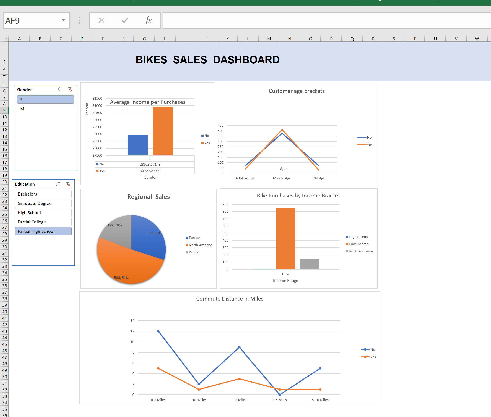

# 🚴 Bikes Sales Dashboard

## 📊 Overview
The Bikes Sales Dashboard is an interactive Excel-based visualization tool designed to analyze bike purchase behavior across different customer demographics, income levels, and regions. It helps stakeholders understand key sales trends and customer insights through dynamic charts and slicers.

## 🎯 Purpose
This dashboard is built to:
* **Analyze bike purchase patterns** (Yes/No)
* **Compare customer demographics** (gender, age, education)
* **Understand income influence** on purchasing behavior
* **Evaluate regional sales distribution**
* **Measure commute distance impact** on bike purchases

---

## 📌 Key Features

### 🎛️ Interactive Filters (Slicers)
* **Gender:** (Male / Female)
* **Education Level:** Bachelors, Graduate Degree, High School, Partial College, Partial High School

*These filters dynamically update all charts in the dashboard.*

---

## 📈 Visualizations Included

### 💰 Average Income per Purchase
* Compares average income of customers who purchased vs. those who did not.
* Helps identify income influence on buying decisions.

### 👥 Customer Age Brackets
Segments customers into:
* **Adolescence**
* **Middle Age**
* **Old Age**
* *Shows purchase distribution across age groups.*

### 🌍 Regional Sales Distribution
Displays sales share across:
* **Europe**
* **North America**
* **Pacific**
* *Helps identify top-performing regions.*

### 💵 Bike Purchases by Income Bracket
Categorizes purchases by:
* **Low Income**
* **Middle Income**
* **High Income**
* *Highlights dominant customer segments.*

### 🚶 Commute Distance vs Purchase Behavior
Compares bike purchases based on commuting distance:
* 0–1 Miles
* 1–2 Miles
* 2–5 Miles
* 5–10 Miles
* 10+ Miles
* *Shows how commute length affects likelihood of purchase.*

